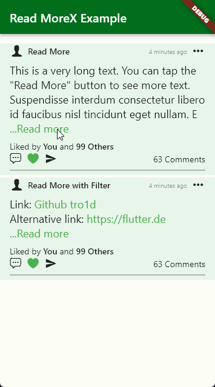

# `Read MoreX`

The `read_morex` package is a Flutter widget that allows you to manage the display of long text with a "Read More" button that lets users expand to view the entire text or collapse it to a shorter version. It allows you to set a maximum number of lines and a maximum length for the text. When the content exceeds these limits, it provides a 'Read more' link, allowing users to see the full content, and a 'Show less' link to collapse it again. You can also apply custom text filters using regular expressions to highlight or modify specific patterns within the text. This widget offers flexibility and control over how text content is displayed and filtered within your Flutter app.



## Installation

You can import the `read_morex` package into your Flutter project by adding the following dependency to your `pubspec.yaml` file:
```yaml
dependencies:
  read_morex: ^1.0.0
```
Don't forget to run flutter pub get after adding this dependency.

## Usage
Here's how to use it:
#### Import the read_morex package:
```Dart
import 'package:read_morex/read_morex.dart';
```
#### Use the ReadMoreX widget in your layout:
#### `[Read More]`
```Dart
ReadMoreX(
    'This is a very long text. You can tap the "Read More" button to see more text. Suspendisse interdum consectetur libero id faucibus nisl tincidunt eget nullam. Eu nisl nunc mi ipsum faucibus vitae aliquet nec.',
    textStyle: const TextStyle(fontSize: 18),
    readMoreColor: Colors.green,
    fontWeightLabel: FontWeight.normal,
),
```
#### `[Read More with Filter]`
```Dart
ReadMoreX(
    'Link: https://github.com/tro1d\nAlternative link: https://flutter.dev\n\nEmail: readmorex@demo.com\nPhone: 0808080889',
    textStyle: const TextStyle(fontSize: 18),
    readMoreColor: Colors.green,
    filterContent: true,
    fontWeightLabel: FontWeight.normal,
    customFilter: <ReadMoreXPattern>[
        ReadMoreXPattern(
            pattern: r'github.com', // Sensitive https://
            valueChanged: (value) => value?.replaceFirst('https://github.com/', 'Github '),
            onTap: (value) {
                ScaffoldMessenger.of(context).showSnackBar(
                SnackBar(content: Text('This Link $value')),
                );
            },
        ),
        ReadMoreXPattern(
            pattern: r'https://', // Sensitive https:// , after github.com
            onTap: (value) {
                ScaffoldMessenger.of(context).showSnackBar(
                SnackBar(content: Text('This Link $value')),
                );
            },
        ),
        ReadMoreXPattern(
            pattern: r'\b[0-9]{9,}\b',
            colorChanged: Colors.red,
            onTap: (value) {
                ScaffoldMessenger.of(context).showSnackBar(
                SnackBar(content: Text('This Number $value')),
                );
            },
        ),
        ReadMoreXPattern(
            pattern: r'\b[A-Za-z0-9._%+-]+@[A-Za-z0-9.-]+\.[A-Z|a-z]{2,}\b',
            colorChanged: Colors.deepPurple,
            onTap: (value) {
                ScaffoldMessenger.of(context).showSnackBar(
                SnackBar(content: Text('This Email $value')),
                );
            },
        ),
    ],
),
```

Full example can be found at [`example/lib/post_card.dart`](example/lib/post_card.dart).